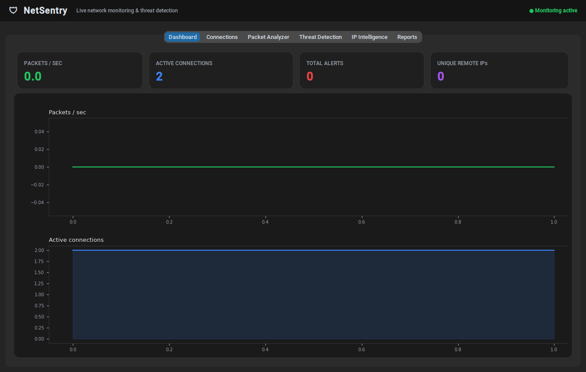
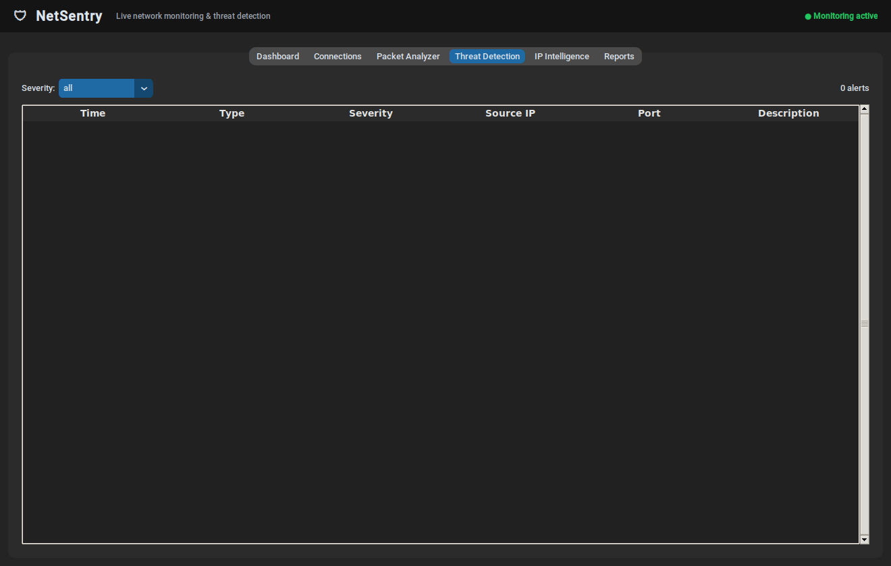
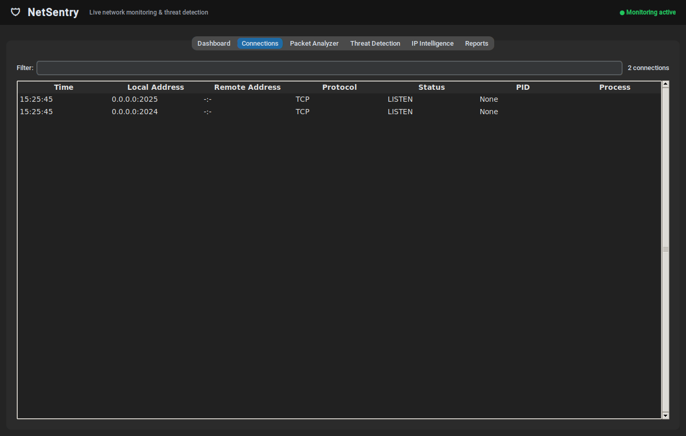
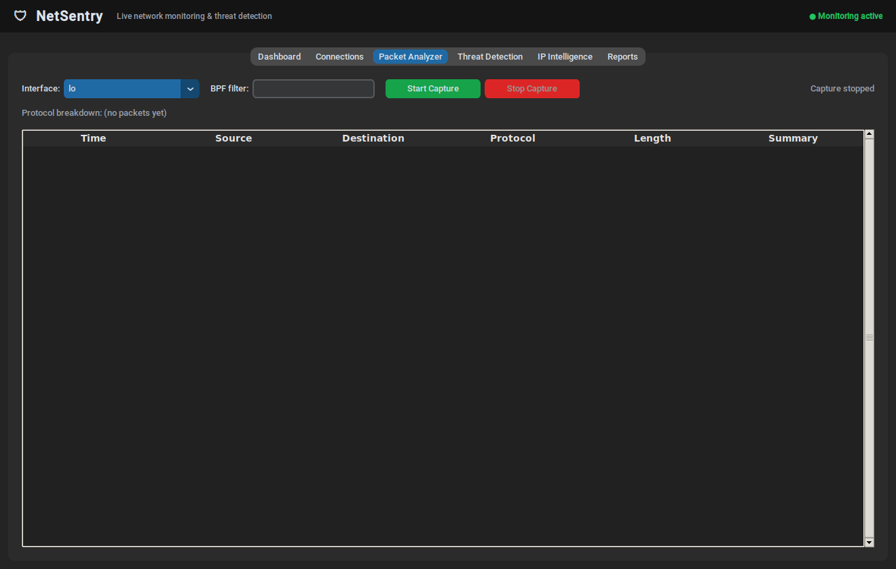
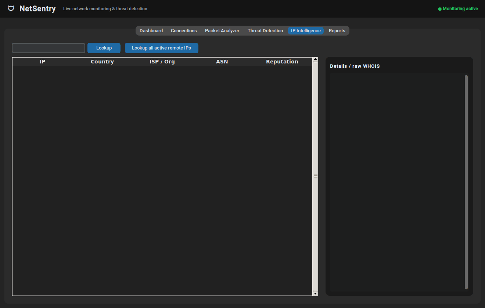
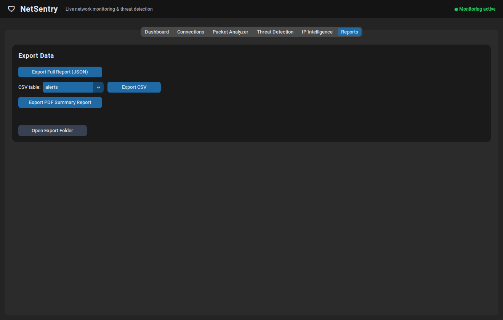

# 🛡️ NetSentry

**A desktop network-monitoring and threat-detection tool built in Python.**

NetSentry watches your machine's live network activity — active sockets, raw
packets, and DNS traffic — and flags suspicious behavior in real time: port
scans, brute-force attempts, DNS tunneling / DGA-style domains, and abnormal
traffic spikes. It ships with IP intelligence (WHOIS/ASN/geolocation/
reputation) and one-click JSON/CSV/PDF reporting.

Built as a portfolio project to demonstrate systems-level Python (threading,
asyncio, raw sockets via Scapy, SQLite), applied security engineering
(rule-based intrusion detection), and a polished desktop UI.



---

## Features

| Module | What it does |
|---|---|
| **Live Network Monitor** | Polls every active OS socket via `psutil` — source/destination IP, ports, protocol, connection state, owning process — refreshed every 1.5s. Works without admin rights. |
| **Packet Analyzer** | Captures and classifies raw traffic with `Scapy` — TCP, UDP, DNS, HTTP, ICMP — with live packets/sec and a protocol breakdown. Requires Npcap (Windows) or libpcap (Linux/macOS) + elevated privileges. |
| **Threat Detection** | A rule-based engine running against both connection and packet streams: port-scan detection, excessive-connection detection, brute-force pattern matching on sensitive ports (SSH/RDP/SMB/DB), suspicious DNS activity (query floods, high-entropy/DGA-style domains, bad TLDs), and traffic-spike detection against a rolling baseline. |
| **IP Intelligence** | WHOIS/RDAP + ASN via `ipwhois`, geolocation/ISP via ip-api.com, and a reputation score (real score via an optional AbuseIPDB key, or a transparent local heuristic otherwise). Batches lookups concurrently with `asyncio`. Results are cached in SQLite. |
| **Dashboard** | Live stat cards (packets/sec, active connections, alert count, unique remote IPs) plus Matplotlib graphs embedded in the UI. |
| **Reports** | Export everything collected to JSON, per-table CSV, or a formatted PDF summary (via ReportLab). |



---

## Tech stack

- **UI:** Python, `customtkinter` (dark, modern desktop UI) + `tkinter.ttk` for tables
- **Packet capture:** `Scapy`
- **System/connection data:** `psutil`
- **Storage:** `SQLite` (single file, thread-safe wrapper)
- **Charts:** `Matplotlib` embedded via `FigureCanvasTkAgg`
- **Networking/HTTP:** `requests`, `ipwhois`
- **Reports:** `reportlab` (PDF), stdlib `csv`/`json`
- **Concurrency:** `threading` for background monitor/capture loops (Tkinter is single-threaded, so all UI updates are drained from thread-safe queues on the main loop); `asyncio` for concurrent batched IP-intelligence lookups

---

## Project structure

```
NetSentry/
├── run.py                        # entry point
├── config.json                   # all thresholds/settings live here
├── requirements.txt
├── netsentry/
│   ├── app.py                    # main window, wires everything together
│   ├── database.py               # thread-safe SQLite layer
│   ├── network_monitor.py        # psutil connection polling thread
│   ├── packet_analyzer.py        # scapy capture thread
│   ├── threat_detection.py       # detection engine (5 rule types)
│   ├── ip_intelligence.py        # WHOIS/ASN/geo/reputation + asyncio batching
│   ├── report_generator.py       # JSON / CSV / PDF export
│   ├── utils.py                  # config, logging, entropy, private-IP checks
│   └── gui/
│       ├── dashboard_tab.py
│       ├── connections_tab.py
│       ├── packets_tab.py
│       ├── threats_tab.py
│       ├── ip_intel_tab.py
│       ├── reports_tab.py
│       └── widgets.py            # shared table/stat-card widgets
├── tests/                        # pytest unit tests (23 tests)
└── screenshots/
```

---

## Getting started (Windows + VS Code)

### 1. Prerequisites

- **Python 3.10+** — [python.org](https://www.python.org/downloads/) (check "Add Python to PATH" during install)
- **Npcap** — [npcap.com/#download](https://npcap.com/#download) — required *only* for the Packet Analyzer tab (raw packet capture). Install with **"WinPcap API-compatible mode"** checked. Live connection monitoring, threat detection on connections, IP intelligence, and reporting all work fine without it.
- **VS Code** with the Python extension

### 2. Clone and set up a virtual environment

```powershell
git clone https://github.com/<your-username>/netsentry.git
cd netsentry

python -m venv venv
venv\Scripts\activate

pip install -r requirements.txt
```

### 3. Run it

```powershell
python run.py
```

For the **Packet Analyzer** tab to capture traffic, close VS Code / your terminal and re-open it **as Administrator**, then run `python run.py` again — Windows raw sockets require elevation.

### 4. Run the test suite

```powershell
pip install -r requirements-dev.txt
pytest
```

23 unit tests cover the SQLite layer and every threat-detection rule (port
scan, brute force, excessive connections, DNS flood, DGA-style domains,
suspicious TLDs, alert cooldown/de-duplication).

---

## Configuration

Every detection threshold and app setting lives in `config.json` — nothing is
hardcoded. For example, to make port-scan detection more sensitive:

```json
"port_scan": {
  "distinct_ports_threshold": 15,
  "window_seconds": 20
}
```

To get real (not heuristic) IP reputation scoring, drop a free
[AbuseIPDB](https://www.abuseipdb.com/account/api) API key into:

```json
"ip_intelligence": {
  "abuseipdb_api_key": "YOUR_KEY_HERE"
}
```

---

## How the threat detection works

NetSentry's detection engine is intentionally rule-based and explainable —
every alert traces back to a threshold you can see and tune in
`config.json`, rather than an opaque ML score:

- **Port scan** — one remote IP touching N distinct local ports within a
  sliding time window.
- **Excessive connections** — one remote IP opening an unusually high
  connection count in a short window (possible DoS/botnet behavior).
- **Brute force** — repeated connection attempts targeting a sensitive port
  (22/SSH, 3389/RDP, 445/SMB, 21/FTP, 3306/MySQL, 5432/Postgres) from the
  same source.
- **Suspicious DNS activity** — abnormal query rates (possible tunneling /
  exfiltration), high-entropy domain labels (a lightweight DGA signal), and
  known-abused TLDs.
- **Traffic spikes** — current packets/sec measured against a rolling
  baseline, flagged once it exceeds a configurable multiplier.

Each rule maintains its own sliding-window state (`collections.deque`) keyed
by source IP, with a cooldown so an ongoing attack produces one alert instead
of a flood of duplicates.

---

## Screenshots

| Connections | Packet Analyzer |
|---|---|
|  |  |

| IP Intelligence | Reports |
|---|---|
|  |  |

---

## Known limitations

- Packet capture requires Npcap/libpcap + admin/root — this is an OS
  constraint on raw sockets, not something the app can work around.
- Reputation scoring falls back to a local heuristic (clearly labeled as
  such in the UI) unless an AbuseIPDB key is configured — there's no
  built-in unauthenticated threat-intel feed with reliable rate limits.
- IPv6 connections are tracked in the connections table but the packet
  classifier currently focuses on IPv4 + IPv6 basic parsing without deep
  extension-header handling.

## License

MIT — see [LICENSE](LICENSE).
